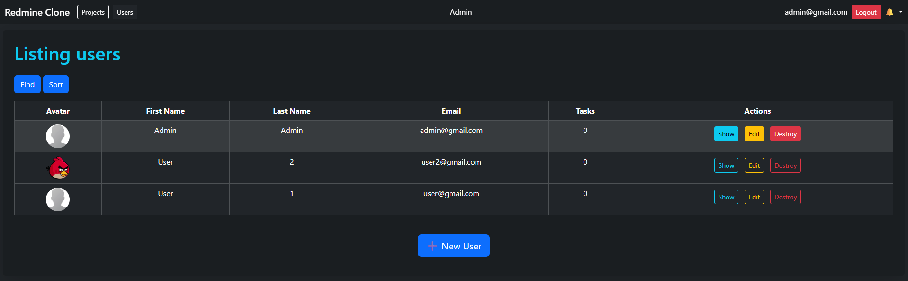
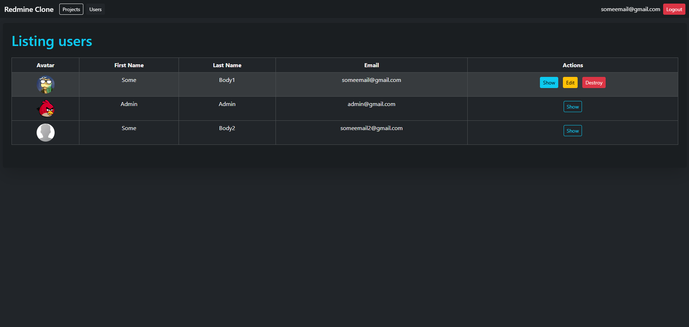
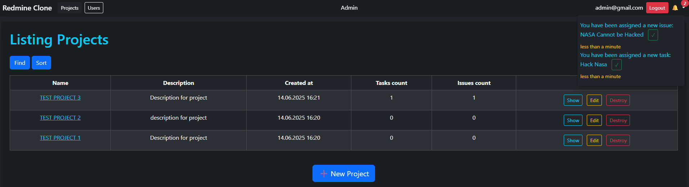
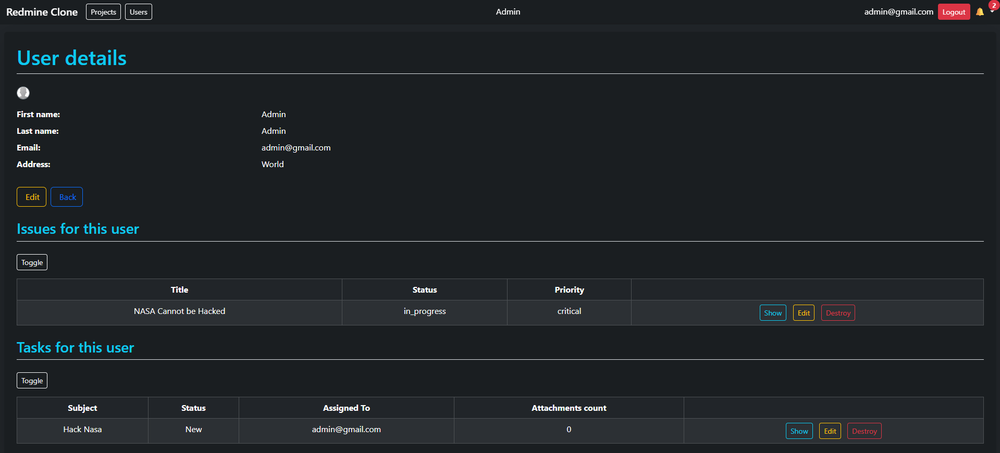

# 🛠️ Redmine Clone

A web application inspired by Redmine – used for managing projects, tasks, and users. Built with **Ruby on Rails**, styled with **Bootstrap**, and using **HAML** for views.

## ✨ Features

- 🔐 User authentication and registration via **Devise**
- 🧑‍💼 Role-based access control using **CanCanCan**
- 📁 Project and task management with user assignment
- 🔔 Notification system
- 🖼️ Avatar uploading via **ActiveStorage**
- 🔍 Search and filtering with **Ransack** + **SimpleForm**
- 💅 Clean UI with **Bootstrap 5** and **HAML** templating

## 🚀 Getting Started

1. **Clone the repository:**
   ```bash
   git clone https://github.com/Harangus/redmineclone.git
   cd redmineclone

2. Install dependencies
    ```bash
    - bundle install

3. Setup database
    ```bash
    - rails db:create db:migrate

4. Start the server
    ```bash
    - rails s

## Admin

- Admin can edit, destroy every project or user
- To create admin user, first register a regular user via the app, then in console:
    ```bash
    rails c
    u = User.find_by(email: "user@email.com")
    u.add_role :admin

## Used technologies
- Ruby (3.4.4)
- Rails (8.0.2)
- PostgreSQL
- Devise
- CanCanCan
- Ransack
- SimpleForm
- Kaminari
- Bootstrap 5
- HAML

## Screenshots





